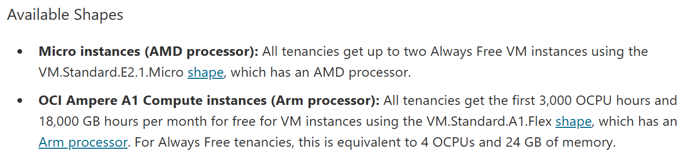

# How did this idea started
Before the oracle server, I had a powerful 6-core CPU with 16GB of RAM on [Google Cloud Server](https://cloud.google.com/) running stuff like Minecraft Server, proxying, and rendering useless maps for fun.

Along the way, I learnt a lot about the command in Ubuntu Linux. But since the server was running on a free credit, after around 3 months, the credit ran out and I forgot to stop it. Costing me a fortune of 6.8 POUNDS outside of the free credit.

For a period of time, I was having "server-less life" and it felt like someone was missing. Then, I came across a reddit post stating that oracle gives free ARM servers, and they do look quite powerful. So here we go.

## Determine the resources we can use

First of all, Oracle provide two types of free shapes. You can read more about it [here](https://docs.oracle.com/en-us/iaas/Content/FreeTier/freetier_topic-Always_Free_Resources.htm)

:::note
In many places, the ARM instance is not avaliable, so you will need some luck to get it. I chose France (Paris) and appearently all of the ARM instances are taken. So I had no choice but to use the AMD Processor instance.
:::

To create an account, you first head to [Oracle](https://www.oracle.com/). Where you will find "View Accounts" at the top right corner, and "Sign Up for Free Cloud Tier"

Carefully go through the regestration. Choose a region that is cloest to you for better network performance and connection.

:::warning
It is important to use real adress and card details, since Oracle have the rights to confiscate your server at any point. And Oracle does check your card detail frequently. DO NOT USE a VPN and digital bank cards during set up process
:::

After regestration, head to the [Cloud Console](https://cloud.oracle.com/). At the top of the page, search for "Instance", and click the "Instance" under "Services"

Now, you want to "Create instance". Set the name to anything you want.

For the image part, if you know which type of OS Server works best for you, choose it. If not, I would recomment Ubuntu server

Edit the shape, go for Virtual machine and under "Specialty and previous generation" you will find the AMD Processor, and "Ampere" you will find the ARM Processor. It is recommended to go for the ARM processor as it often has mnuch better performance, and you get more RAM **(WOW! Free RAM in this economy?)**

Tap on the Add OCPU button as high as possible until it said you ran out of limit. Click Apply, and head to the next section. Enable Security and next. Create a Primary VNIC, Virtual Cloud Network and a subnet by following the guide on the website. You do not have to change any of the settings when creating them.

:::important
At the bottom of the Networking page, there is a option for "Download private key" and "Download public key". YOU MUST download the private key or else YOU WILL NOT be able to ssh into your server later on, and the whole process is runied. For the public key, download at your own preference.
:::
